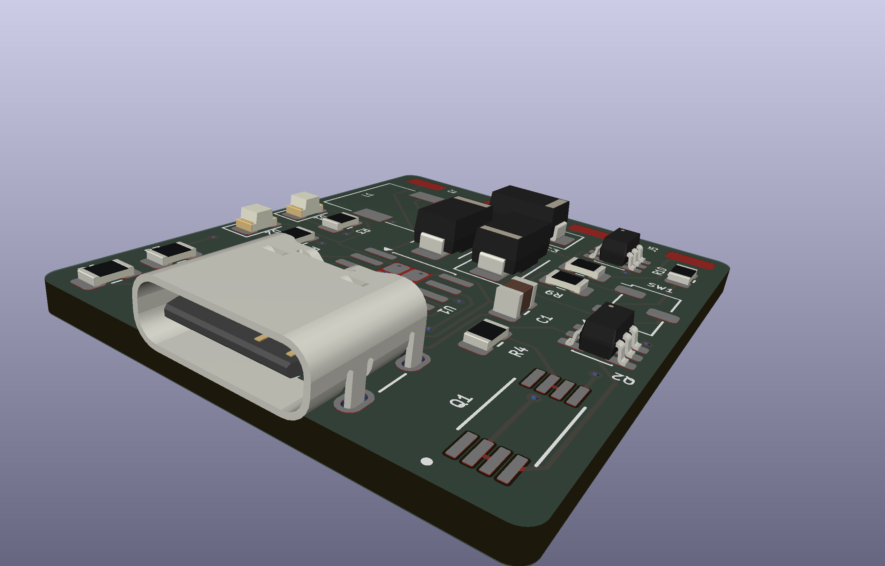
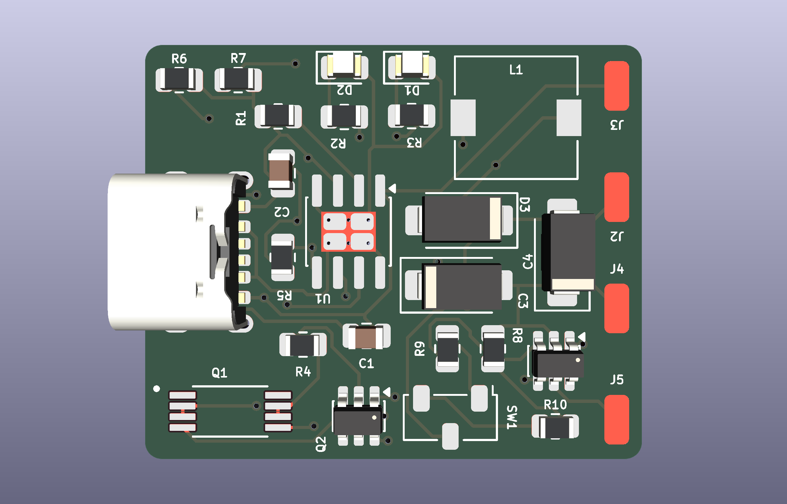
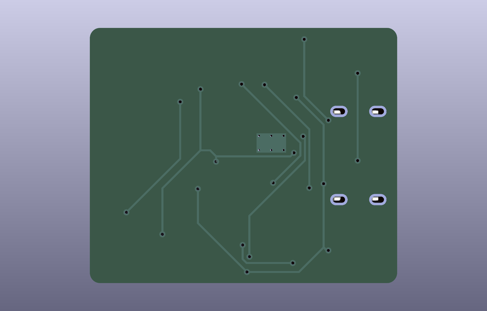
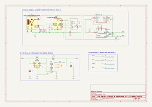
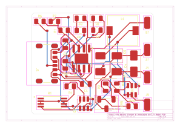

<div align="center">

# Project 2 — Power Management System

**A compact, integrated PCB for Li-Po battery charging, protection, and switch-selectable 5 V / 12 V output.**

Combines a TP4056 Li-Po charging stage, DW01A/FS8205A battery protection, and an MT3608 boost
converter on a single two-layer board — designed for portable electronics, IoT nodes,
Arduino-based projects, and lightweight UAV subsystems.

[](https://www.kicad.org/)
[](LICENSE)
[](https://www.oshwa.org/)
[](#)

</div>

---

## Table of Contents

- [Overview](#overview)
- [3D Board Renders](#3d-board-renders)
- [Schematic](#schematic)
- [PCB Layer Breakdown](#pcb-layer-breakdown)
- [Bill of Materials & Manufacturing Files](#bill-of-materials--manufacturing-files)
- [Repository Structure](#repository-structure)
- [Getting Started](#getting-started)
- [License](#license)

---

## Overview

| | |
|---|---|
| **Board name** | Project 2 — Power Management System |
| **Function** | Li-Po charging + protection + selectable 5 V/12 V boost output |
| **Charging IC** | TP4056 (USB Type-C input, CC/CV charging) |
| **Protection ICs** | DW01A + FS8205A (overcharge / over-discharge / overcurrent) |
| **Boost converter** | MT3608 (switch-selectable ≈5 V / ≈12 V output) |
| **Layers** | 2-layer PCB |
| **EDA tool** | KiCad v10 |

---

## 3D Board Renders

<div align="center">

<table>
  <tr>
    <td align="center"><strong>Isometric View</strong></td>
    <td align="center"><strong>Top View</strong></td>
    <td align="center"><strong>Bottom View</strong></td>
  </tr>
  <tr>
    <td></td>
    <td></td>
    <td></td>
  </tr>
</table>

</div>

---

## Schematic

Full schematic of the charging, protection, and boost-conversion circuitry:

<div align="center">
  
</div>

> If the vector render above does not display (GitHub occasionally sandboxes inline SVG),
> open it directly: [`docs/images/schematics/project2.svg`](docs/images/schematics/project2.svg).
> A PNG fallback may also be available at `docs/images/schematics/project2.png`.

---

## PCB Layer Breakdown

### Primary Layers

**Top Copper (F.Cu)** | **Bottom Copper (B.Cu)**
:---:|:---:
 | 

**Top Silkscreen (F.Silkscreen)** | **Bottom Silkscreen (B.Silkscreen)**
:---:|:---:
 | 

**Board Outline (Edge.Cuts)**
:---:


### Supplementary Layers

<details>
<summary><strong>All-Layers Overlay</strong> (click to expand)</summary>
<br>



</details>

<details>
<summary><strong>Solder Mask Layers — Top (F.Mask) &amp; Bottom (B.Mask)</strong> (click to expand)</summary>
<br>

**Top Solder Mask (F.Mask)** | **Bottom Solder Mask (B.Mask)**
:---:|:---:
 | 

</details>

---

## Bill of Materials & Manufacturing Files

| Deliverable | Description | Link |
|---|---|---|
| 📋 Bill of Materials | Full component list with references, values, and quantities | [`docs/power_management_system_bom.csv`](docs/power_management_system_bom.csv) |
| 🏭 Gerber Files | Fabrication-ready Gerber package for PCB manufacturing | [`gerbers/`](gerbers/) |
| 🧩 STEP 3D CAD File | Mechanical 3D model for enclosure/assembly integration | [`step/`](step/) |
| 🗂️ KiCad Project | Top-level KiCad project file | [`project2.kicad_pro`](project2.kicad_pro) |
| 🔲 KiCad PCB Layout | Editable PCB layout file | [`project2.kicad_pcb`](project2.kicad_pcb) |
| ⚡ KiCad Schematic | Editable schematic source file | [`project2.kicad_sch`](project2.kicad_sch) |

> **Note:** If the BOM is provided as a spreadsheet instead of CSV, use
> [`docs/power_management_system_bom.xlsx`](docs/power_management_system_bom.xlsx).

---

## Repository Structure

```text
pcb-lipo-power-management-system/
├── docs/
│   ├── images/
│   │   ├── 3d_views/
│   │   │   ├── 3d_top.png
│   │   │   ├── 3d_iso.png
│   │   │   └── 3d_bottom.png
│   │   ├── schematics/
│   │   │   └── project2.svg
│   │   └── pcb_layers/
│   │       ├── pcb_All_layers.svg
│   │       ├── project2-F_Cu.svg
│   │       ├── project2-B_Cu.svg
│   │       ├── project2-F_Silkscreen.svg
│   │       ├── project2-B_Silkscreen.svg
│   │       ├── project2-F_Mask.svg
│   │       ├── project2-B_Mask.svg
│   │       └── project2-Edge_Cuts.svg
│   └── power_management_system_bom.csv
├── gerbers/
│   └── (fabrication Gerber + drill files)
├── step/
│   └── (STEP 3D CAD export)
├── assets/
│   └── datasheets/
│       └── (component datasheets: TP4056, MT3608, DW01A, FS8205A, etc.)
├── .history/
│   └── (local edit history / backups, excluded from releases)
├── .gitignore
├── DRC.rpt
├── report.txt
├── project2.kicad_pro
├── project2.kicad_pcb
├── project2.kicad_prl
├── project2.kicad_sch
├── LICENSE
└── README.md
```

> **Note:** `.history/`, `DRC.rpt`, `report.txt`, and `temp-freerouting.dsn` are local
> KiCad/tooling artifacts. Consider adding them to `.gitignore` if they don't need to be
> version-controlled — they're listed here only for completeness.

---

## Getting Started

1. **Clone the repository**
   ```bash
   git clone https://github.com/devKOff/pcb-lipo-power-management-system.git
   cd pcb-lipo-power-management-system
   ```
2. **Open in KiCad v10**
   Open [`project2.kicad_pro`](project2.kicad_pro) in KiCad to view or edit the schematic and PCB layout.
3. **Manufacture the board**
   Send the contents of [`gerbers/`](gerbers/) directly to your PCB fabricator, and reference
   [`docs/power_management_system_bom.csv`](docs/power_management_system_bom.csv) for assembly.
4. **Mechanical integration**
   Import the STEP file from [`step/`](step/) into your CAD tool of choice for enclosure or
   assembly design.

---

## License

This project is released under the terms of the [MIT License](LICENSE). Hardware design files
are shared in the spirit of open source hardware — see the OSHW badge above.

> **Note:** No `LICENSE` file currently exists in this repository. Add one (e.g. via GitHub's
> *Add file → Create new file → LICENSE* flow, which offers an MIT template) so the badge and
> link above resolve correctly — see Step 6 in the upload guide below.

<div align="center">

*Maintained as part of the Project 2 — Power Management System hardware design effort.*

</div>